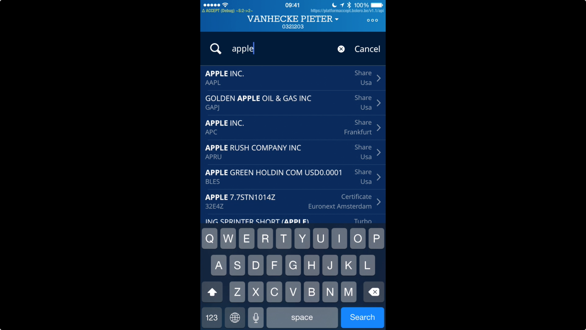
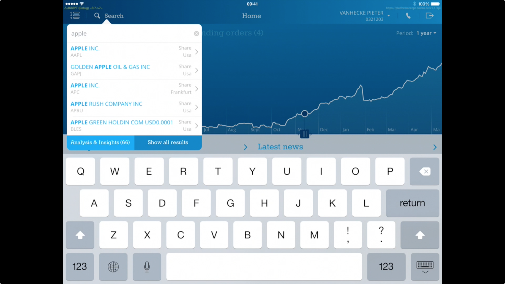
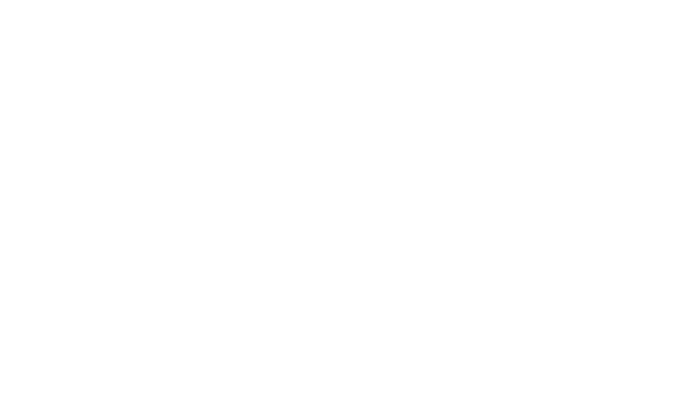

autoscale: true

<br>

#[fit] Async ViewControllers

<br>
<br>

_**Tom Adriaenssen**_
@inferis

---

#[Fit] View
#[Fit] Controllers

^ A lot of our code lives in view controllers

^ They're used to display data to the user and let the user interact with the data

^ Standard, well known mechanism when developing iOS apps

---


^ But most of the data isn't local, or static

^ a lot of data comes from the slowish source, and is not immediately available

---

#[Fit] Async

^ most obvious example: data from the network

^ but also: location fixes

^ or even complex database queries

^ so we need to display to the user that we're waiting on that source

---

# Anatomy of async data

1. start slow call
2. show **hey, keep yer pants on** indicator
3. wait for call to finish
4. remove **pants** indicator
5. show your actual data

^ So the setup is basically always the same

^ repetive when needed in lots of places

^ make a "common" component
- reduces duplicate code
- consistent

---

# Some history

^ I was in the same boat

^ Current role is Lead Developer at iCapps Antwerp.

^ I was hired to make 2 iOS apps for a trading platform called Bolero

^ Their 2.0 platform was written in Flex.

---


^ Which doesn't work too good on mobile devices

^ Bolero 3.0 was going to be a rewrite from the ground up, featuring a new website and mobile apps

^ a REST based backend was created

^ Lots of separate rest calls

---



^ So we build the iPhone app first, dev team of 5 (including me)

^ the screen you see is one of 5 main screens, each with several sub screens need each at least one data call

^ "watch carefully", goes fast

---


^ We released the iphone app in June 2014. By then, we had 5 problems:

---

# Massive View Controller

^ 5 massive view controllers

^-lot of interaction
-lots of doublish code which was similar but not quite
-hard to navigate, large files

---

### Massive View Controller

# iPhone - 1.0

```objc
// Lines of code, including whitespace

* Hotspot:
  * HSViewController .h: 25, .m: 716
  * HSBoxController .h: 44, .m: 370
* Portfolio: .h: 14, .m: 523
```

^ for example, 2 of those controllers

^ hotspot is the one you saw in action

^ 1155 lines for hotspot!

^ this does not include the code for each view

---



^ After iPhone, we started work on the iPad app

^ Which was even more complex than the iPhone app

^ team grew to 8 devs eventually

^ The video shows part of the "hotspot", which is on of 10 main screens in the app, most of similar complexity

---


---

# *Technical*
# *debt*

^ too much technical debt

^ and we only just started

^ current approach would be unmaintainable with large dev team and size of codebase

---

# Break
# things
# up

^ so we had to: break things up

^ side effect: split off our codebase
- maintenance branch for iPhone
- development branch for iPad

^ get back to that later

---

#*Introducing*
#[Fit] AsyncViewController

---


---

```objc
@interface AsyncViewController : UIViewController

@property (nonatomic, strong, readonly)
              UIView<AsyncView> *asyncView;
@property (nonatomic, strong, readonly)
              UIView<AsyncStatusView> *statusView;

- (void)performAsyncDataRequest;

@end
```

^ AsyncViewController basically looks like this.

^ yes, I know this is objective-C

---

## Y U NO *SWIFT*?


^ why don't I write this in Swift, like all the hip kids are doing?

^ first of all: codebase was in Objective-C

^ ands secondly...

---

```objc
@property (nonatomic, strong) UIView<IIAsyncView> *asyncView;
```

^ we can't do this because of this line

---

`UIView<IIAsyncView> *`

^ Or to be more precise, this part.

^ In Swift, we can't enforce the needed combination of protocols and classes, yet

^
- we need UIViews because they need to be added to the view stack
- and we need the protocols for the async functionality

---

> @Inferis None yet. You can define a generic parameter <T: BaseClass where T: Protocol>, but that isn't representable as a type yet.
-- @jckarter

^ I asked on twitter about this, and Joe Groff of the Swift team at Apple answered this.

^ So you can do it for generics, but not as a type declaration.

---


^ Soon, perhaps?

---

*`rdar://20990743`*

^ I filed a radar for this. Feel free to dupe it.

---

*`rdar://20990743`*


---

```objc

@interface AsyncViewController : UIViewController

@property (nonatomic, strong, readonly)
              UIView<AsyncView> *asyncView;
@property (nonatomic, strong, readonly)
              UIView<AsyncStatusView> *statusView;

- (void)performAsyncDataRequest;

@end
```

^ AsyncViewController basically looks like this.

^ There are 3 key ingredients here...

---

#[Fit] *subclass* of
#[Fit] `UIViewController`

^ we get all the UIViewController goodies for free

^ people know this shit

^ we need UIViewController for overriding view loading

^ you can use keep using storyboards or xibs

^ best part: we can use view controller containment!

---

```objc
@property (nonatomic, strong, readonly)
              UIView<AsyncView> *asyncView;
```

^ the async view is responsible for showing the view*

^ it conforms to the a protocol that knows how to pass data to the view

^ uniform way of setting data

---

```objc
@property (nonatomic, strong, readonly)
              UIView<AsyncStatusView> *statusView;
```

^ the status view is a wrapper view around the async view

^ it only shows the async view when 'data has been delivered'

^ it handles transitions between states

^ uniform way of showing intermediate state

---

#[Fit] `- performAsyncDataRequest`

^ The entry point to request data

^ by default: does nothing

^ you're free to handle load data in whatever way you want

^ GCD, OperationQueues, Core Data query, AFNetworking call, ...

---

### async data fetch

#### *__&__*

### statusView + asyncView

#### *__&__*

### View controller containment

^ these three form a strong combination

^ The controller fetches the data it wants to display

^ the status view handles displaying something to the user in the meanwhile, or when something goes wrong

^ the async view shows the data when it's there

^ and this for only one part of your app

---

# SRP

^ Single Responsibility Principle

^ Each controller is responsible for its own data

^ where to get it, how to show it, what to do when showing it

^ separate calls for only needed data

^ Need to show more than 1 set of data? make more controllers

^ aggregation of data can still be done, performAsyncDataRequest doesn't care

^ things become easier to test!

---

## A more pure
#[fit] *MVC*

^ this also brings us a more pure MVC model

^ no presentation management in controller = no subview management or animations

^ the controller is only responsible for
- fetching
- interaction with the rest of app (delegates, notifications, signals)

^ no "businss logic" in views, they only need care about presentation

^ allow forwarding of user interaction through delegation to controller (can do whatever it wants with it)

---

# Ease of use

^ the extended API is simple enough to use

^ implement one method

^ create view (something you need to do anyway)

^ optionally customize status view

---

# Flexible

^ The APIs are open to extension

^ rely on protocols, you can replace any of the views with your own

^ Add more controller subclasses for further generic implementations

^ Let's take a look at these protocols

---

# Testable

^ breaking up things allow you to test them more easily

^ the viewcontroller is fully testable for interaction between async view, async view data and async status view

^ going farther than controller, you can also easily test each component, whether they are your own or the default implementations

^ even if you don't write tests, thinking about how you would write them makes your code better
- less intrinstic dependencies
- smaller code blocks


---


^ Now we're getting to the code part, finally

---

```objc
@protocol IIAsyncView <NSObject>

@required
@property (nonatomic, strong, readonly) id<AsyncData> asyncData;

- (void)asyncDataApplyValueAnimated:(BOOL)animated;

@optional
// ...

@end
```

^ this is the async view protocol

^ as you can see, it's actually pretty simple

^ data property to contain the async data (we'll get to that in a minute)

^ a method as a single point of implementation to apply data when needed. when this is called:
-> view should display the data.
-> Can be animated, depending on how data is set. Usually is YES.
-> Up to developer how to implement it.

^ optionals = nonessential -> cover them in a bit

---

```objc
@protocol IIAsyncData <NSObject>

@required
@property (nonatomic, assign, readonly) BOOL loading;
@property (nonatomic, strong) NSError *error;
@property (nonatomic, strong) id value;

- (void)reset;

@end
```

^ Async data protocol

^ there's three important values here: loading, error, and data

^ represent states the data can be in, and allows you to transition between them by setting the properties

---

```objc
typedef NS_ENUM(NSUInteger, AsyncStatusViewState) {
    IIAsyncStatusLoading,
    IIAsyncStatusError,
    IIAsyncStatusNoData,
    IIAsyncStatusData
};
```

^ These are the states we're going to be in

^ Loading: the data is not here yet

^ Error: something went wrong, display an error

^ No Data: the call was fine, but no data was returned

^ Data: the call was fine, show this data

^ there's a difference between non-nil data and nil data: non-nil data doesn't mean something's wrong, but there's nothing to show, so you'll still want the user to show something useful (e.g. a message)

---



^ in a diagram, that looks a bit like this

^ you start off in an initial empty state, which automatically amounts to loading

^ depending on what property you set, the data transitions to the correct state

^ finally: the reset method resets the async data to the initial (and thus loading) state


---

```objc
- (AsyncStatusViewState)determineState
{
    // determine the new state
    if (![self isAsyncViewLoaded] || [self.asyncView.asyncData isLoading]) {
        return AsyncStatusLoading;
    }
    else if (self.asyncView.asyncData.error) {
        return AsyncStatusError;
    }
    else if (self.asyncView.asyncData.value) {
        return AsyncStatusData;
    }
    else {
        return AsyncStatusNoData;
    }
}
```

^ and so checking for state becomes really simple

^ whenever's there's a state change, all we have to do is this

^ so now how do these state changes get communicated to whoever needs them?

---

```objc
@protocol IIAsyncData <NSObject>

@required
@property (nonatomic, assign, readonly) BOOL loading;
@property (nonatomic, strong) NSError *error;
@property (nonatomic, strong) id value;
@property (nonatomic, weak) id<IIAsyncDataDelegate> asyncDataDelegate;

- (void)reset;
- (void)invalidateState;

@end


@protocol IIAsyncDataDelegate <NSObject>

@required
 - (void)asyncData:(id<IIAsyncData>)data
        didInvalidateStateForced:(BOOL)forced;
- (void)reloadAsyncData;

@end
```

^ the asyncDataDelegate is a simple delegate

^ 1 callback to communicate state changes from data to container (the view controller) so it can react to it

^ the reloadAsyncData callback signals the container to reload the async data. This can be used in case of an error to retry the request, or even through a manual refresh action (pull to refresh).

---

```objc
@protocol AsyncView <NSObject>

@required
// ...

@optional
- (id)asyncNoDataMessage;
- (BOOL)asyncCanReload;

@end
```

^ This brings us back to our async view: there are a few optionals there to accomodate error messages

^ the asyncNoDataMessage represents an message that can be shown when there's no data. This is (id) for flexibility but usually will be a string

^ the other method defines reloading behavior it asks the view if it should be able to reload.

^ this is used in error or no data scenarios to check if a "reload" button should be shown (or some other UI)

---

```objc
@protocol AsyncStatusView <NSObject>

@required
@property (nonatomic, strong) UIView<IIAsyncView> *asyncView;

- (void)transitionToLoadingStateAnimated:(BOOL)animated;
- (void)transitionToErrorState:(NSError*)error animated:(BOOL)animated;
- (void)transitionToNoDataStateAnimated:(BOOL)animated;
- (void)transitionToDataStateAnimated:(BOOL)animated;

@end
```

^ Finally, the AsyncStatusView protocol.

^ this holds a reference to the async view (which it should add as a subview)

^ and defines some methods to drive the state changes

^ it does not have to manage state itself: it just has to react to the changes and show the correct views

---

```objc
@interface AsyncData : NSObject <AsyncData>

@interface AsyncView : UIView <AsyncView>

@interface AsyncStatusView : NSObject <AsyncStatusView>

@interface AsyncViewController : UIViewController
```

^ until this moment, all we've seen is one class and several protocols

^ there are - of course - also default implementations of each protocol

^ these are named exactly like the protocols

^ you can use these as a base to work from, or implement the protocols in your own views

---

```objc
@interface IIAsyncViewController : UIViewController

- (void)reloadAsyncData;


- (UIView<IIAsyncStatusView>*)loadStatusView;


- (void)willTransitionToNewStateAnimated:(BOOL)animated;
- (void)didTransitionToLoadingStateAnimated:(BOOL)animated;
- (void)didTransitionToErrorStateAnimated:(BOOL)animated;
- (void)didTransitionToDataStateAnimated:(BOOL)animated;
- (void)didTransitionToNoDataStateAnimated:(BOOL)animated;

@end
```

^ there's a little more to the public interface of AsyncViewController

^ `reloadAsyncData`: convenience method to reload data (reset async view + performasyncrequest)

^ `loadStatusView` allows you to provide a different status view, if you don't want the default

^ and finally, there's a few methods you can override when you want to react to status changes in the controller

---

# Example

^ Let's show a quick example of how this works.

---

```objc
@interface SuchViewController ()

@property (nonatomic, strong) LaggyBackend *backend;

@end

@implementation SuchViewController

- (void)performAsyncDataRequest
{
    [self.backend thatReallySlowCall:^(id result) {
        self.asyncView.asyncData.value = result;
    } error:^(NSError* error) {
        self.asyncView.asyncData.error = error;
    }];
}


@end
```

^ as you can see, the performAsyncDataRequest method can and should be really simple.

^ also, notice that we don't need to care for threading at this point:
- we're certain that the views are already loaded (unless you call performAsyncDataRequest yourself, which is not the intention)
- just setting properties on a view doesn't really matter if you do it on a background thread or a main thread
- the status view calls `asyncDataApplyValueAnimated:` on the async view in the transition to data state, which is called on the main thread anyway

^ if you need to do more processing here, now's the time (because you're usually on a background thread)

---

```objc
@interface SuchView ()

@property (nonatomic, strong) IBOutlet UILabel *label;

@end

@implementation SuchView

- (void)asyncDataApplyValueAnimated:(BOOL)animated
{
    self.label.text = [NSString stringWithFormat:
                          @"Such %@", self.asyncData.value];
}

- (BOOL)asyncCanReload
{
    return self.asyncData.error != nil;
}
```

^ and the view code itself is/can be pretty simple to: it only has to care about showing the data

---

# Under the hood

^ Now how does this work?

---

```
// In AsyncViewController

- (void)viewDidLoad
{
    [self wrapWithStatusView];

    // call regular viewDidLoad
    [super viewDidLoad];

    // force an update of the state to loading
    [self updateState:YES];

    [self performAsyncDataRequest];
}
```

^ The setup of the async stuff happens in view did load

^ we don't do it earlier because we don't want to load data before it is necessary

^ you can always speed up the process by accessing the views

---

```objc
- (void)wrapWithStatusView
{
    // don't wrap if there's a status view already
    if (self.statusView) return;

    // get async view. This is just self.view when first wrapping.
    UIView<IIAsyncView> *asyncView = (UIView<IIAsyncView>*)self.view;

    // now create the status view
    UIView<IIAsyncStatusView> *statusView = [self loadStatusView];
    statusView.frame = asyncView.frame;
    statusView.asyncView = asyncView;
    asyncView.asyncData.asyncDataDelegate = self;

    // make main view the wrapping view
    [super setView:statusView];
}
```

^ wrapWithStatusView delivers: it wraps the async view with a status view

^ we take the .view property of the controller (check if it's an async view - not shown here)

^ load the status view and pass the asyncView to it

^ finally, set the statusview as the controller root view

---


^ But let's stop there. There's a problem.

---

```objc
@interface UIViewController (UILayoutSupport)

// These objects may be used as layout items
// in the NSLayoutConstraint API

@property(nonatomic,readonly,strong)
                id<UILayoutSupport> topLayoutGuide;
@property(nonatomic,readonly,strong)
             id<UILayoutSupport> bottomLayoutGuide;

@end
```

^ when using storyboards (this can happen with xibs too), vertical constraints might be linked to the topLayoutGuide and bottomLayoutGuide

^ when wrapping our async view from the xib, we remove the view from the hierarchy but add it again

^ and we set another view as the view for the controller

^ both actions cause the layout guides to change. Constraints linked the old guides are gone!

---


^ this means: it's time for some UIKit magic.

---

1. find constraints related to layout guides before wrapping
* wrap views
* first layout pass: recreate constraints

---

```objc
- (NSArray*)findLayoutGuideConstraints:(UIView*)view
{
    NSMutableArray *constraints = [NSMutableArray new];

    UIViewController *viewController = [self findViewDelegate:view];
    if (!viewController) return;

    for (NSLayoutConstraint *constraint in view.constraints) {
        if (constraint.class != [NSLayoutConstraint class]) continue;

        if (constraint.firstItem == viewController.topLayoutGuide ||
            constraint.secondItem == viewController.topLayoutGuide) {
            [constraints addObject:@[constraint, @YES, viewController.topLayoutGuide]];
        }
        else if (constraint.firstItem == delegate.bottomLayoutGuide ||
                 constraint.secondItem == delegate.bottomLayoutGuide) {
            [constraints addObject:@[constraint, @NO, viewController.bottomLayoutGuide]];
        }
    }

    return [constraints copy];
}
```

^ walk over constraints of view

^ 1: only look for actual instances of NSLayoutConstraint, other constraints related to layout guides are of type UILayoutConstraint

^ 2: remember all constraints linked to top or bottom layout guide, also remember the constraint and whether it's the top or the bottom layout

---

```objc
- (UIViewController*)findViewDelegate:(UIView*)view
```

^ we're playing outside our boundaries here

^ each view set as the root view of a viewcontroller has a viewDelegate ivar. You can find this out by disassembling the UIKit code.

---

```objc
- (UIViewController*)findViewDelegate:(UIView*)view
{
    const char *ivarName = [[NSString stringWithFormat:@"_%@Delegate", @"view"] UTF8String];

    Ivar ivar = class_getInstanceVariable(view.class, ivarName);

    UIViewController *delegate = nil;
    if (ivar) {
        delegate = object_getIvar(view, ivar);
        if ([delegate isKindOfClass:[UIViewController class]]) {
            return delegate;
        }
    }

    return nil;
}
```

^ accessing it requires a bit of runtime voodoo: ask the class for the ivar, and then get the value of the ivar

^ it's not complicated!

---

## *👋 *

^ warning: things like this might break in the future. There's no guarantee that iOS9 will have "viewDelegates"!

^ when delegate dissappears, won't crash but will look like shit.

---

```objc
- (void)reapplyLayoutGuideConstraints:(NSArray*)constraintInfos
{
    UIViewController *viewController = [self findViewDelegate:self];
    if (!viewController) return;

    for (NSArray *constraintInfo in constraintInfos) {
        NSLayoutConstraint *oldConstraint = constraintInfo[0];
        BOOL topGuide = [constraintInfo[1] boolValue];

        // replace first and/or second item with new guides
        id firstItem = oldConstraint.firstItem == constraintInfo[2]
          ? (topGuide ? viewController.topLayoutGuide : viewController.bottomLayoutGuide) :
          : oldConstraint.firstItem;
        id secondItem = oldConstraint.secondItem == constraintInfo[2]
          ? (topGuide ? viewController.topLayoutGuide : viewController.bottomLayoutGuide)
          : oldConstraint.secondItem;

        // Create new constraint
        NSLayoutConstraint *constraint =
            [NSLayoutConstraint constraintWithItem:firstItem
                                         attribute:oldConstraint.firstAttribute
                                         relatedBy:oldConstraint.relation
                                            toItem:secondItem
                                         attribute:oldConstraint.secondAttribute
                                        multiplier:oldConstraint.multiplier
                                          constant:oldConstraint.constant];
        [self addConstraint:constraint];
    }
}

```

^ Now with the constraints we found, we reapply them in the first layout pass

^ this is also pretty simple but verbose

^ basically:
- for each recorded constraint
- replace former topLayoutGuide with new topLayoutGuide, and the same for bottomLayoutGuide.
- do this for both firstItem and secondItem of the constraint.
- leave other values as they are.

^ after that, do another layout pass

---


^ You're a real hacker now that you've use objective-C runtime calls.

---

# Details

^ There's a little bit more to it, but those are implementation details.

^ check out the demo project for full source code!

---

#[Fit] Massive
#[Fit] View Controller

### *A reprise*

^ so back to our massive view controller numbers

---

### Massive View Controller

# iPhone - 1.0

```objc
// Lines of code, including whitespace

* Portfolio: .h: 14, .m: 523
* Hotspot:
  * HSViewController .h: 25, .m: 716
  * HSBoxController .h: 44, .m: 370
```

^ remember these?

^ iPad done, got some time from client to refactor codebases to bring them together

^ the maintance iphone branch was merged into the development branch: one codebase beneficial for future features and maintenance

^ so we refactored the iPhone codebase based on the things we learned doing the ipad app

---

### Massive View Controller

# iPhone - 1.2

```objc
// Lines of code, including whitespace

* Portfolio: .h: 16, .m: 373
* Hotspot:
  * HSViewController: .h: 28, .m: 539
  * HSBoxController: 41.h, .m: 108
```

^ Turns out, we still have a large view controllers.

^ Given the time constraints and the changed ipad codebase, this was the mimimal we could/have to do

^ and of course, there's still a lot of code in the sub controllers, but they are more respectable in size

^ and more maintainable

---

### Massive View Controller

# iPhone - 1.0 vs 1.2

```objc
* Portfolio: .h: 114%, .m: 71%
* Hotspot:
  * HSViewController: .h: 112%.h, .m: 75%
  * HSBoxController: .h: 93%.h, .m: 29%
```

^ looking at the relative sizes, this isn't that bad

^ the app certainly is easier to navigate code wise

^ and there's a lot less implicit dependencies

---

¯\\\_(ツ)\_/¯

^ but more code be done, but you know: budgets

---

# Takeaway

^ So what's the takeaway on this?

---

1. embrace *View Controller Containment*
2. reduce dependencies
3. avoid boilerplate
4. DRY
5. testable

^ small components are better

^ view controller containment does not make your app suck performance wise

^ more maintainable

^ don't write repetitive boiler plate code

^ make sure you can test everything (even if you don't write test, think about how to make your code testable)

---

#[Fit] Open Source

^ this code is open source

---

Reference implementation:

```
http://github.com/inferis/IIASyncViewController
```

^ The reference implementation for this "pattern" is available on github, of course.

^ this contains the controller, a simple async status view and a demo project

^ also available as a cocoapod

---

<br>

# Thanks!

<br>
<br>

Get in touch!

*@inferis
http://inferis.org*

^ so that wraps this up.

^ I hope you enjoyed it, and feel free to contact me for any questions
